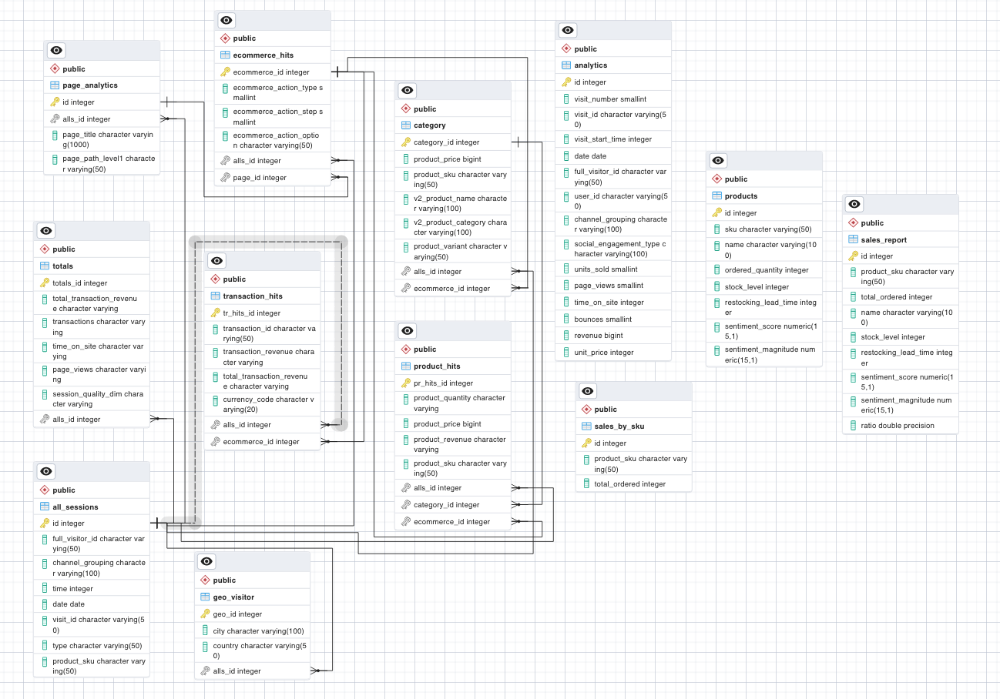

# Final-Project-Transforming-and-Analyzing-Data-with-SQL

## Project/Goals

(fill in your description and goals here)

## Process

### (your step 1)

### (your step 2)

## Results

(fill in what you discovered this data could tell you and how you used the data to answer those questions)

## Challenges

(discuss challenges you faced in the project)

## Future Goals

(what would you do if you had more time?)
