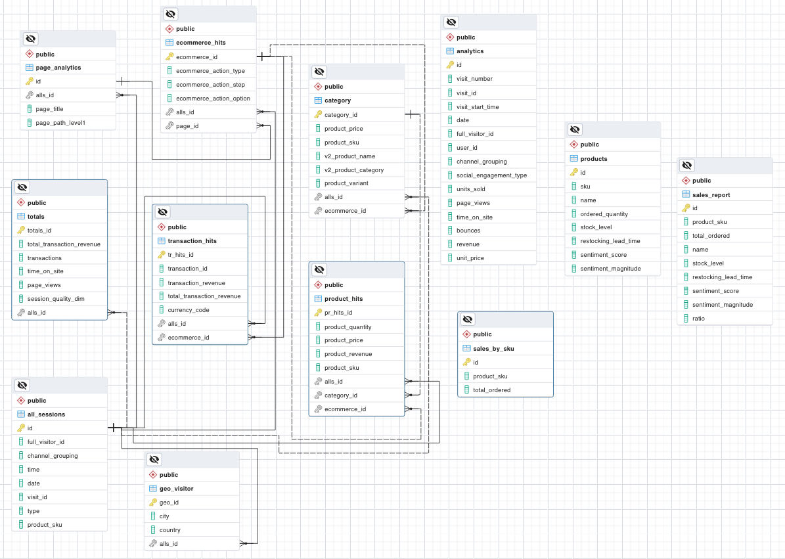

# Final Project Transforming and Analyzing Data with SQL

## Project/Goals

To apply new techniques acquired during the first week of the Lighthouse Labs Data Science bootcamp, among which included:

1. Importing a CSV formatted dataset into a PostgreSQL database
1. Applying data cleaning techniques using PostgreSQL
1. Perform quality assurance on the dataset

## Process

Steps followed:

1. Data was inspected for obvious errors and inconsistencies such as data type mismatch, and abrupt changes in formatting.
1. Data familiarization to better understand the dataset, such as expected vs unexpected data results, and the meaning of data columns and values.
1. Removing inconsistencies, such as duplicate or irrelevant data.
1. Handling missing data
1. Data verification and quality assurance was performed by running queries to assess the relevance and validity of the data.
1. Documentation of tracked changes with self-documenting code and formatting with concise commenting and relevant rationales

## Results

Without the objective benefit of statistical analysis applied to the dataset, a few subjective observations could be made at best until further cleaning, analysis, and quality assurance processing can take place:

- Significant disproportionate representation of cities from the US than any other countries (see starting_with_data).
- Google Nest purchases in Mountain View are quite high which appears to be correlated with the location of Google Headquarters. One could theorize that employees might be required to purchase units for QA assurance and testing purposes, or the population of Mount View quite enjoy a constant temperature
- Youtube is evidently a more successful shopping platform than I was previously aware

### ERD with Relationships

## Challenges

There were a few technical difficulties, specifically regarding the permissions for PgAdmin to access the CSV files while importing.

Accidental loss of data during cleaning required the recreation and importing of the of table data and re-apply the cleaning techniques. As a result I found ways to mitigate against data loss using transactions.

## Future Goals

1. Complete a more thorough cleaning of the data. For example, the `all_sessions` table is oversized and contains data that could be pulled out into new or existing tables, and further constraints applied to facilitate the entity relationships. For example the `all_sessions` transaction related column data could be moved into a new `transactions` table, and the product related column data moved into the existing `products` table. This would significantly improve the accessibility of the data contained within the database.
1. Cross analysis of existing column data to create appropriate entity relationships to improve understanding of the dataset and help with further analysis.
1. Explore alternative planning methods regarding the approach to the data cleaning process, such as project mapping using sticky notes posted on the wall to provide a large visual representation of entities, relationships, and data related issues.
